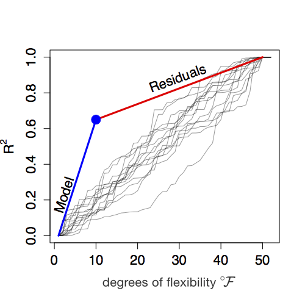

# F and R

We now have the pieces we need to assemble the central quantity which informs statistical inference. These are:$\newcommand{\flex}[]{^\circ\!\cal{F}}$

1. $n$, the sample size (or, more concretely, the number of rows in out data frame)
2. $v_r$, the variance of the response variable. $v_r$ for binary categorical response variables is based on the 0-1 encoding.
3. $v_m$, the variance of the model values.
4. $\flex$, the *degree of flexibility*.^[If  you are reading  this book in conjunction with a conventional text, remember  that such texts frame inference in terms of the *degrees of **freedom**,* df. The relationship is $\mbox{df} \equiv n -  (\flex +  1)$.]

We'll put these together to form a quantity called F.

## The F statistic

The name, F, is in honor of Ronald Fisher, one of the leading statisticians of the first half of the 20th. The formula for F is pretty simple, so I'll present it right here for ready reference.  

$$F \equiv \frac{n - (1 + \flex)}{\flex} \frac{v_m}{v_r - v_m}$$
For almost all the settings considered in introductory statistics courses, $\flex$ is 1, so the formula simplifies to:
$$F =  (n-1) \frac{v_m}{v_r - v_m}$$


## What's the meaning of F?

F combines the four quantities $n$, $v_r$, $v_m$, and $\flex$. To get a notion why the combination  works, keep these basic ideas in mind concerning what it means to have "more evidence."

- The larger $n$, the more evidence. That's why F is more-or-less proportional to $n$.  (Strictly speaking,  F is proportional to $n - (\flex +  1)$.)
- The more complicated the model -- e.g. the number of explanatory variables or levels in an explanatory categorical variable -- the less evidence. Or, put another way, we would want  more evidence from data to justify a complicated model than  a simple model. The division  by $\flex$ in the formula for F implements this idea.
- The closer the model values come to capturing the actual response variable, the greater the evidence that there is a relationship. An obvious 
way to quantify this closeness are with the difference $v_r - v_m$. We want the size of F to increase as  $v_m$  gets  closer  to  $v_r$. So F is proportional to  $\frac{1}{v_r - v_m}$.
- But the numerical value of the difference $v_r - v_m$ depends on the units in which the response variable  is measured.  For  instance, we could express the running  times in Chapter 1 in minutes or in seconds. But the difference $v_r - v_m$ would be $60^2 = 3600$ times larger if we  used seconds than minutes. Obviously we don't want our F value to depend on the units used. To avoid that, we divide $v_r - v_m$ by $v_m$, getting the $v_m / (v_r - v_m)$ in the formula for F.


## R-squared

Many people prefer to look at a ratio $v_m  / v_r$ to quantify how close the model values are to  the values of the response variable. If the model does a good job accounting for the response variable, then $v_m$ will be close to $v_r$. That is, the ratio will  be close to 1. On the other hand, if the model tells us little or nothing about  the response variable, $v_m$ will  be close to zero and the ratio itself  will be zero.

The ratio has a famous name: *R-squared*,  that  is:

$$R^2 = v_m / v_r$$
A more  obscure name for $R^2$ is *coefficient of determination*, which is awkward but  does express the point  that $R^2$ is about  the extent to  which the explanatory variables, when  passed  through the model, determine the response variable. $R^2$ is, literally, the faction of  the variance of the response variable that has been captured by the model. 

$R^2$ can never be bigger than one and can never be negative. When $R^2 = 1$,  the model  values are  exactly the same as the values of  the response variable. 

When there is no connection between the r esponse and explanatory variables, $R^2$ will be  small. Ideally, it  would be zero, but the process of random sampling generally pushes it a little away from zero. One way to think about F is as indicating  when there is so little  data that a small but non-zero R^2^ is consistent with the hypothesis that there is no connection between the response and explanatory variables.


## F in statistics books

In most statistics book, F is not written in the form above but in one of a couple of alternative -- but  equivalent  -- forms. There's no particular reason to use these forms. Knowing what they look like  will help  you  make sense of traditional statistical reports.

Since $R^2$  summarizes the relationship  between $v_m$ and $v_r$, the formula for F can be written in terms of $R^2$. This is the first of the alternative forms.

$$F = \frac{n - (\flex+1)}{\flex} \frac{R^2}{1 - R^2}$$

Another alternative form comes from using an intermediate in the  calculation  of $v_m$ and $v_r$. Recall how the variance is calculated by calculating square differences and averaging. To average, of course, you  add together the quantities and  then  divide  by the  number of quantities  being averaged.

Suppose you didn't bother  to average, and stopped after adding up the square differences. The name for this intermediate is the  *sum of squares*.
F is often written in terms of the sum of squares of the response variable SS_r_ and of the model values SS_m_. Something like this:

$$F = \frac{n - (\flex+1)}{\flex} \frac{\mbox{SS}_m}{\mbox{SS}_r - \mbox{SS}_m}$$

More typically, instead instead  of  looking at the model  values directly,  the tradition  in  classical inference is to consider what's called the  *sum of squares of the residuals*, which is simply SSR = $\mbox{SS}_r - \mbox{SS}_m$ and the  formula is re-written like this:

$$F = \frac{\mbox{SS}_m / \flex}{SSR / (n -  (\flex + 1))}.$$
Both the numerator and the denominator of this ratio have the form of a sum  of squares divided by a count. In the terminology of classical inference, such things are called *mean squares*. 

In this book, we'll just use the formula for F given at the start of this chapter. The others give exactly the same value, but let's avoid  having  ton work with potentially confusing  vocabulary such  as the  mean square and sum  of squares.

## Another explanation of F

R^2^ is an effective way of measuring how "close" the model values are  to the  response values. When R^2^ $= 1$, the model values are exactly equal to the values of the response variable.

Now recall that  increasing the degrees of flexibility $\flex$ of a model--say be incorporating additional explanatory variables--enables the model values to come closer to the values of the response variable. With  the vocabulary of R^2^, we can express this as "increasing $\flex$ increases R^2^." 

Common sense suggests that the explanatory variables used in a model should be somehow  connected  to the response variable; why else would you  use them? But, in fact, the statement "increasing $\flex$ increases R^2^" is true even if the increased flexibility comes from including completely bogus explanatory variables in the model. As $\flex \rightarrow n - 1$, regardless of the merit of the explanatory variables in the model, R^2^ $\rightarrow 1$.

So how to distinguish between a genuinely meaningful explanatory variable and a bogus, meaningless one? When you add either one to a model, R^2^ will increase. What we ask when deciding whether an explanatory variable is meaningful or meaningless is *how much* did R^2^ go up when the variable was added to the model. The sign that an explanatory variable is  meaningful is that R^2^ goes up by a lot, more than for a typical meaningless variable. 

Let's do a numerical experiment about R^2^ and random, meaningless variables. Suppose we have a data frame with $n=50$. Each of the variables will be constructed by a random-number generator, that is, they are completely unconnected one from the other. Call one of the variables $y$  and the others  $x_1, x_2, x_3,  ...$, going up to, say,  $x_100$.

Setting  the response variable to be y,  we are going to fit a series of models with  these explanatory variables. The first model will have just  one explanatory variable: $x_1$. This model has $\flex = 1$. Fitting  the model, calculate R^2^. We'll want to  keep track of this, so let's label this $\mbox{R}^2_1$. The second model will  have two explanatory variables: $x_1$ and $x_2$ and therefore has $\flex = 2$. Again, calculate R^2^. We'll call this one $\mbox{R}^2_2$. From the nature of model fitting, we know that $\mbox{R}^2_1 \leq \mbox{R}^2_2$. Now fit a model with $\flex  = 3$  using as explanatory variables $x_1$, $x_2$, and $x_3$. The R^2^ for this model will  be called $\mbox{R}^2_3$. And so on, increasing $\flex$ one step at a time. In the end, we'll  have a sequence of R^2^ for the collection of models which must show a non-decreasing pattern:

$$\mbox{R}^2_1 \leq \mbox{R}^2_2 \leq \mbox{R}^2_3 \leq \cdots \leq \mbox{R}^2_{100}$$

Figure 6.13 plots out this sequence of $\mbox{R}^2_i$ against $\flex_i$. The sequence is shown as a dark black line. Note the steady (but somewhat random) increase until R^2^ reaches 1 when $\flex = n-1$. Figure 6.13 also shows several other similar trials, each  of which follows it's own random path up toward R^2^ = 1 when $\flex  = n-1$. This is the signature of meaningless,  bogus explanatory variables.

(ref:R-path-cap) Figure 6.13: The dark path shows one trial in which  $\flex$ is steadily increased by using additional random explanatory variables. The other paths are for similar trials using new random data.

```{r R-path, echo=FALSE, fig.cap="(ref:R-path-cap)"}
knitr::include_graphics("images/14-R2-vs-m.png")
```

IN DRAFT: Relabel x-axis as $\flex$.

In actual practice,  we're not interested in using  random explanatory variables.  In fact, we'd prefer to avoid such  bogus variables in  favor of ones that are genuinely connected to the response variable. The  picture we expect to see is shown in Figure 6.14.

(ref:R-path2-cap) Figure 6.14: $\mbox{R}^2_i$ versus $\flex$. The blue dot shows $\mbox{R}^2_{i=10} for a model with $\flex  = 10$ where the explanatory variables have genuine explanatory power. Note that the path upward to the blue dot is much steeper than for the trials with random explanatory variables. Correspondingly, the path upward *from* the blue dot  is less steep than for the trials with random explanatory variables.

```{r R-path2, echo=FALSE, fig.cap="(ref:R-path2-cap)"}

```

The F statistic quantifies how much steeper is the path to  the blue dot than the paths of the trials with random variables. Specifically,  F is defined as a ratio of slopes: the slope upward to the blue dot divided by the slope upward *from* the blue dot.

We can calculate these two slopes since we know $\flex$, R^2^, and $n$.

* The slope *to* the blue dot is R^2^$/\flex$.
* The slope  *from* the blue dot is (1-R^2^)$/(n - (\flex + 1))$.

Taking the ratio, we have

$$F \equiv \frac{n - (\flex + 1)}{\flex} \frac{R^2}{1-R^2}$$.
