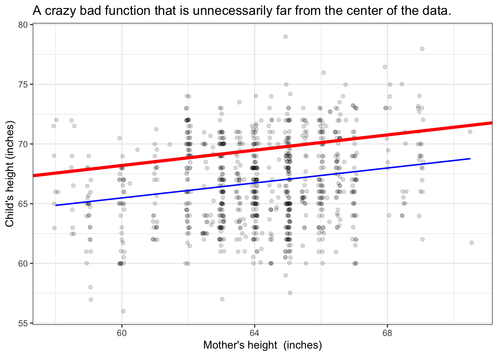

# Modeling variation

The point of statistics is to understand how things vary. For instance, human height varies from on person to another. Some of that variation is associated with the sex  of the person: women *tend to be* slightly shorter than men. Some of  the variation in  height relates to genes and genetic variation. Some to differing nutrition and general health.

Statistical models attempt to use the variation in explanatory variables -- sex, genetic traits -- to account for the variation in a response variable. To offer  a contemporary example, some automobiles are involved in fatal accidents and some (the vast majority, thankfully!) are not; it varies. What's behind the variation? It could be the weather conditions at  the time. It could also be human driver fatique, inebriation, incompetence, distraction, etc. It could also be characteristics of the vehicle itself: size, weight, maneuvrability, breaking power, physical wear, automatic breaking, etc. And a lot of the variation is a matter of chance: for instance, the arrival of another car at an intersection at a particular instant. 

## Statistical models

For our purposes, a statistical model is a mathematical function that takes values of the explanatory variables as input and  produces a corresponding output. For instance, a model of a person's height might take the person's age, sex, mother's height and father's height as inputs and give as output a specific number that we interpret as a kind of idealization of the height of all  the people who have the same values for those inputs. It might happen, by accident, that the model is exactly on target for our particular person. More likely, though, the model output will be somewhat off: the person is somewhat shorter or taller than the model says. This is to be expected since the model can't take into account every factor that influences height and because chance also  plays a role.

You can pretty much draw functions like this by hand. Mathematically, though,  there are some restrictions. First, the function has to stay as close to the data as possible.  Second, the function has to stay centered on the data. (Technically, the function form has to include an intercept.) It might be easiest to understand these restrictions by looking at some crazy bad functions that don't honor the restrictions.

Caption: Some crazy bad functions (in  red) compared to the same  form  of function  matched legitimately to  the data (in blue).  

Note that the blue functions are centered in the sense that whatever value for the explanatory variable you look at, the data points are just about evenly distributed above and below  the function. The red functions don't accomplish this.

## Model values

And the variance of the model values, $v_m$.

## Probability as the model output

For categorical response variables, the output is between zero and one and is interpreted as a probability or proportion.

## Degrees of flexibility

Show some models of increasing flexibility

- continuous explanatory variable
- categorical variable with multiple levels

## Too much explanation

Show how the model exactly reproduces the response variable when there are sufficient degrees of freedom.

