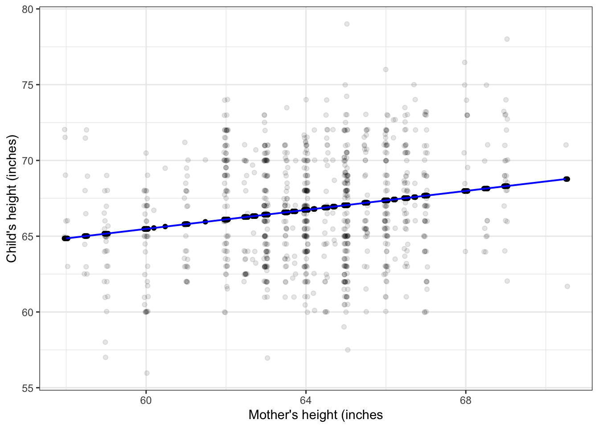
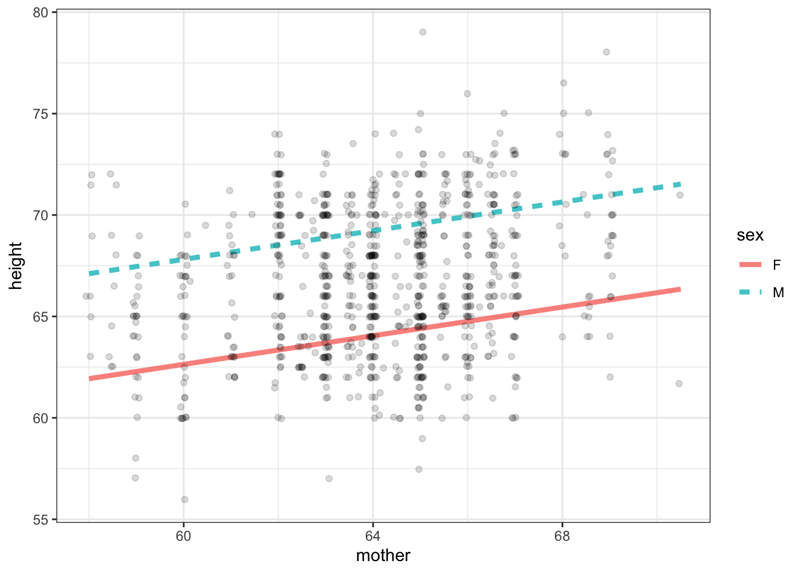
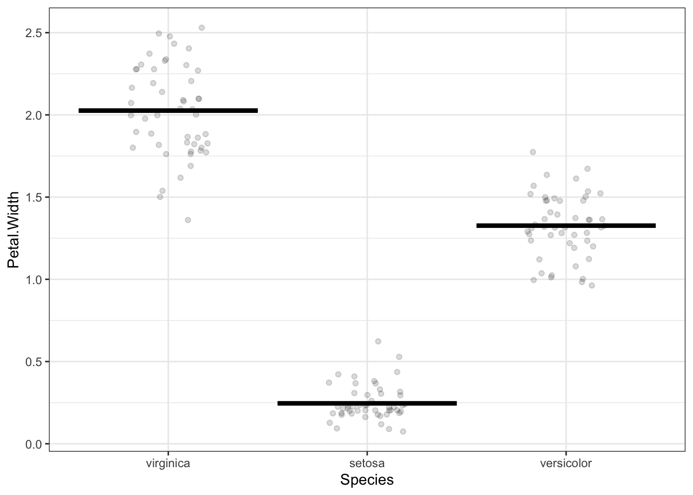

# Model values

And the variance of the model values, $v_m$.

## Training and testing

Non-classical inference: Cross validation

We use the same data for training and testing.  This creates a problem for inference and requires the introduction  of an apparatus to keep track of it.

## Degrees of flexibility

Show some models of increasing flexibility

- continuous explanatory variable
- categorical variable with multiple levels

## Too much explanation

Show how the model exactly reproduces the response variable when there are sufficient degrees of freedom.

