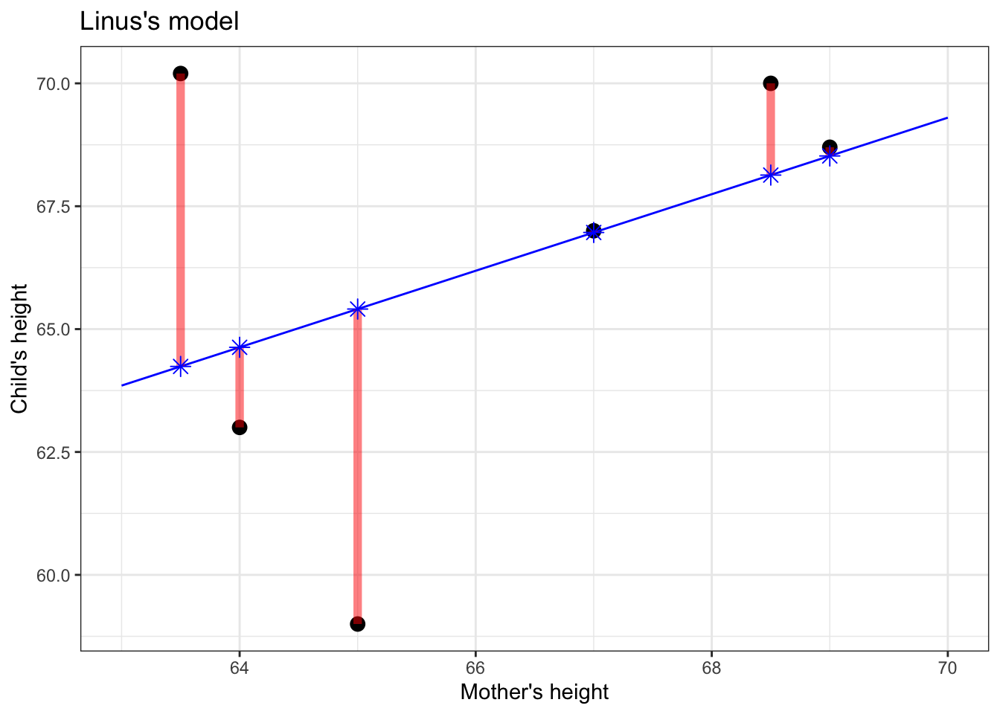
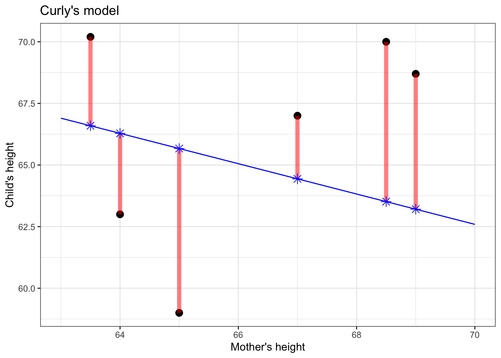
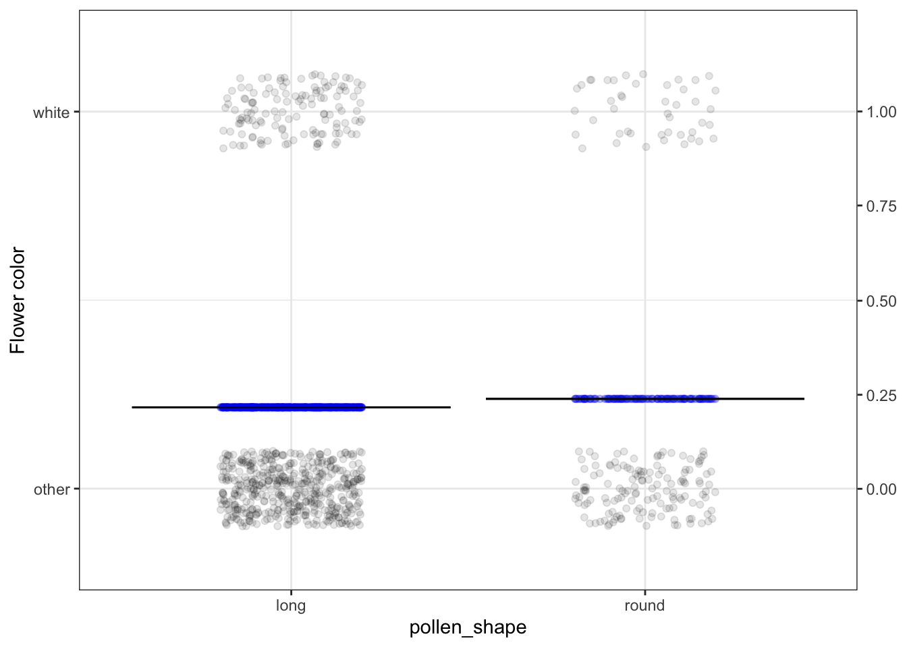
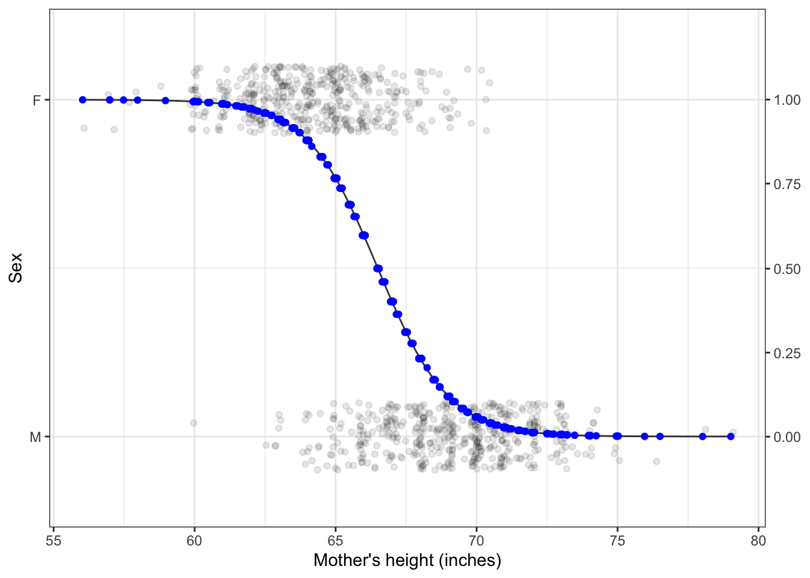

# Model values

It's now time to talk a bit about the way that statistical models are  constructed. To do this, imagine that we have a classroom full of students, each of whom is given data in the form of the graphs of the  previous chapter and asked to draw a straight-line function relating the explanatory  variable to the response variable. Naturally, some students' models will be better than others. How can we determine which model is the best?

To illustrate, let's take a small data set and look at two models that students might draw.

(ref:drawn-train-cap)  Figure 1: Comparing two possible straight-line models. In constructing a model, we choose the candidate with the least error.

(ref:drawn-train-cap)

Who has drawn the better model: Linus or Curly?  The instructor takes out a blue pen and draws a * for every data point. The star marks the output of the model when given the input (mother's height) for that  point. The position of each * on  the vertical axis marks the *model value* for that data point.

Think of the model values as a kind of stand-in for the response variable, one that stays strictly in line with the model.

Now, the instructor takes out her red pen to mark the "error." The error is the difference between the value of the response variable (black dot) and the model value. The less red ink, the better. Linus wins. 

This is analogous to how statistical models are constructed. Once the explanatory and  response variables have been selected, and the shape of the function (here, a straight line), the computer tries out all the possibilities for straight-line models and picks the one that gives the least error between the *model values* and the actual response values.

In practice, for straight-line models (and more general forms, called "linear models"), there are equations that can be solved to find the best model, so there's no need for the computer to try out lots of candidates. But the result is no different than if it had been found by trial and error.

There is something important to notice about the model values for the winning model:

>  *Model values will have a lower variance than the response variable.*

We'll use the symbol $v_m$ to stand for the variance of the model values.

To illustrate this, let's look at a couple of models from the  previous chapter. In each, you can see that the response values (black dots) are spread out,  while the model  values stay in toward the center of data. This is a natural consequence of  our using *central* models, that is, models where the function has roughly equal numbers of data points above it and below it.

(ref:fig2-cap)

(ref:fig2-cap) Figure 2: Model values (blue dots) for a straight-line model of child's height with mother's height as the explanatory variable. Response variance: 12.84; Model value variance: 0.52

(ref:fig3-cap)

(ref:fig3-cap) Figure 3: Model values for the probability that a pea has a flower colored white, with pollen shape as the explanatory variable. Response variance: 0.17; Model value variance: 0.000091

(ref:fig4-cap)

(ref:fig4-cap)  Figure 4: Model values for a model of sex, with mother's height as the explanatory variable. Response variance: 0.25; Model value variance: 0.14

