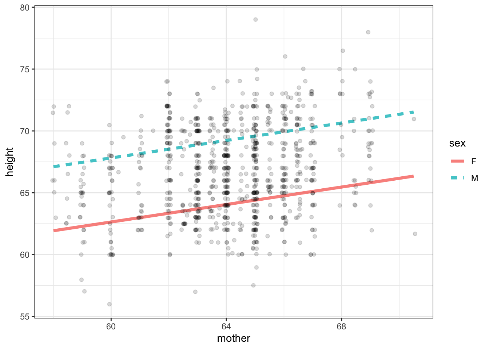
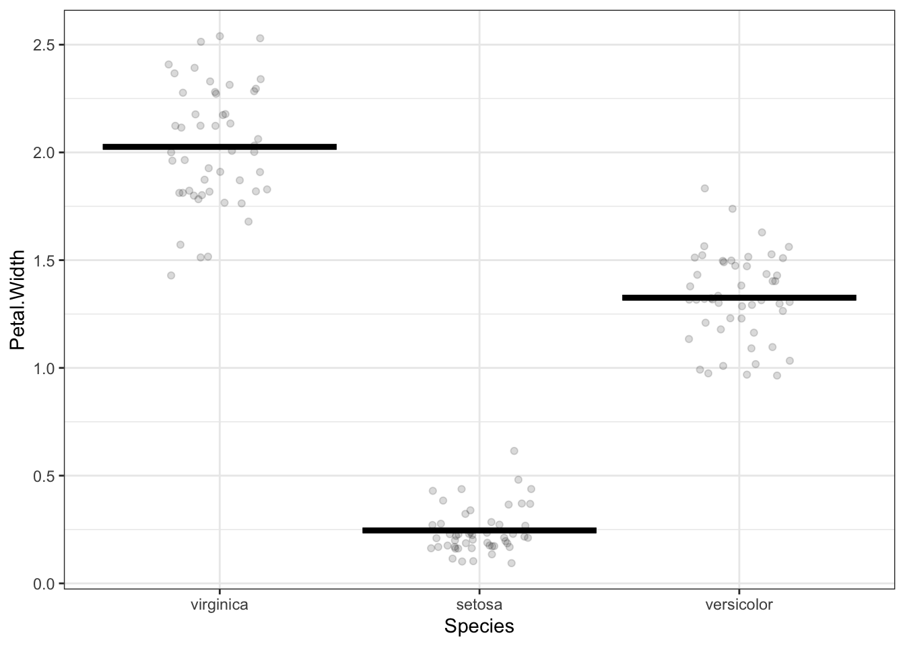
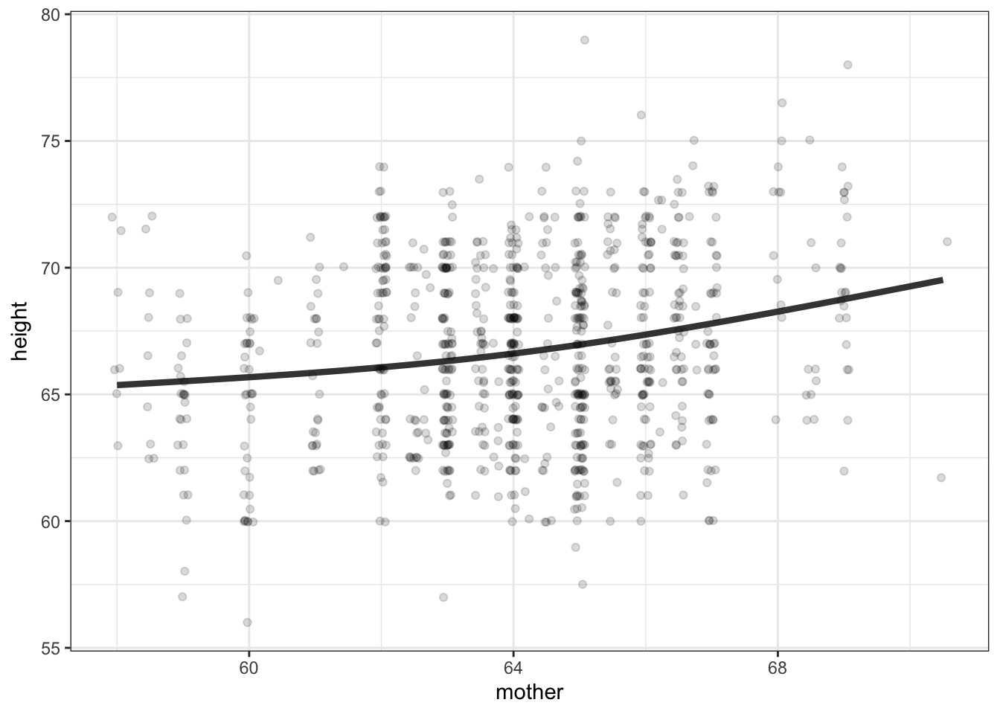
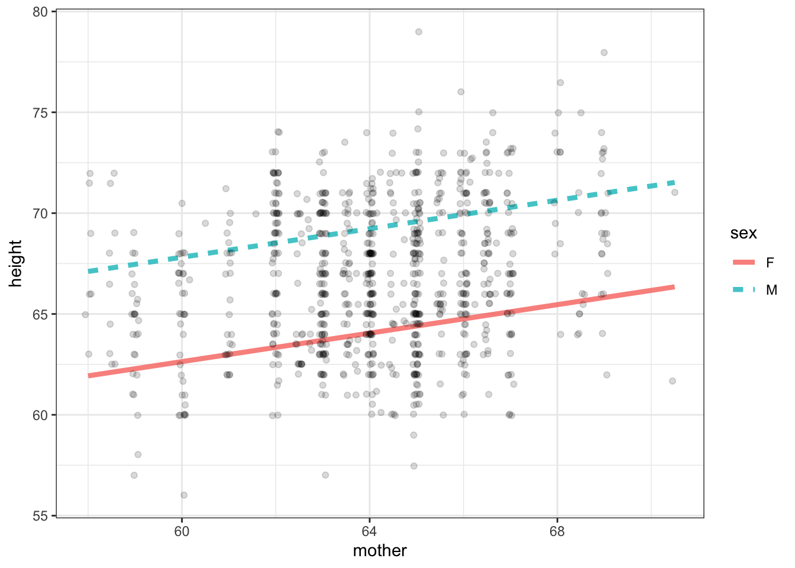
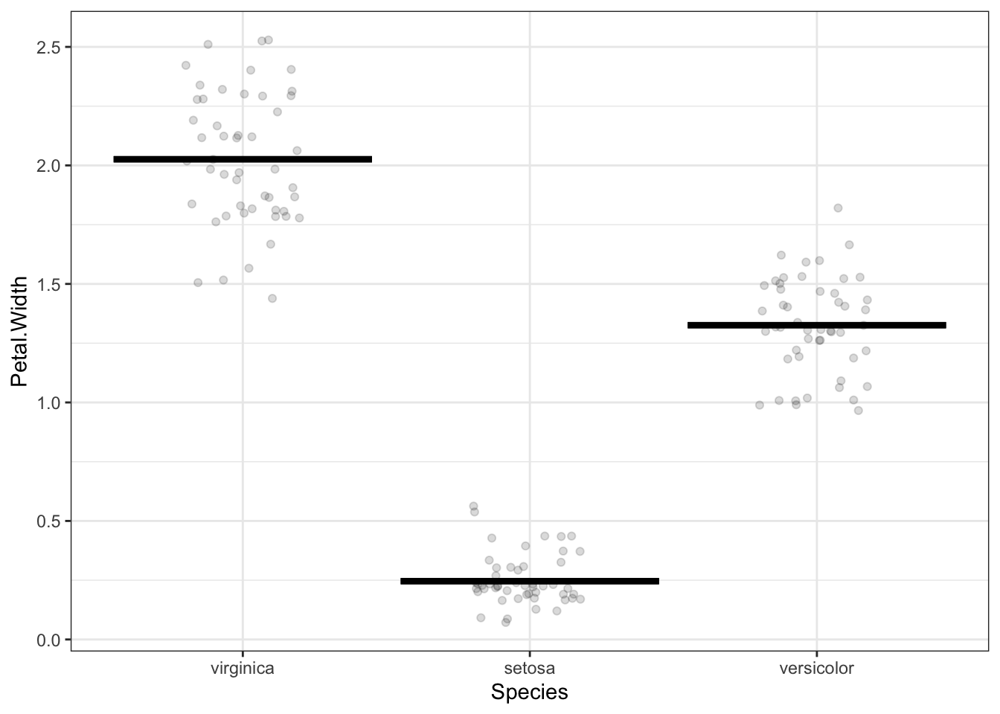

# Multiple explanatory variables

## Covariates

Degrees of flexibility

Show some models of increasing flexibility

- continuous explanatory variable
- categorical variable with multiple levels

## Too much explanation

Show how the model exactly reproduces the response variable when there are sufficient degrees of freedom.

## Too much explanation

Show how the model exactly reproduces the response variable when there are sufficient degrees of freedom.

