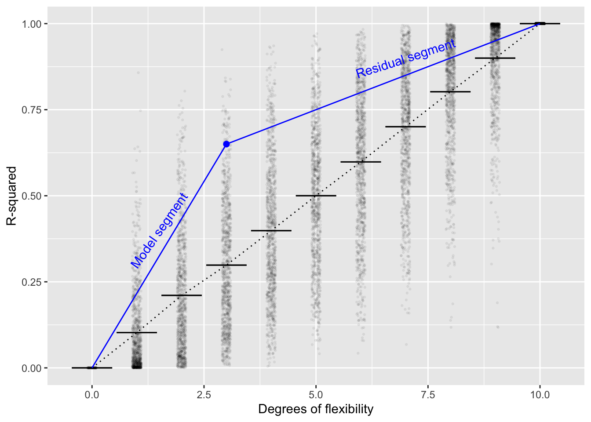
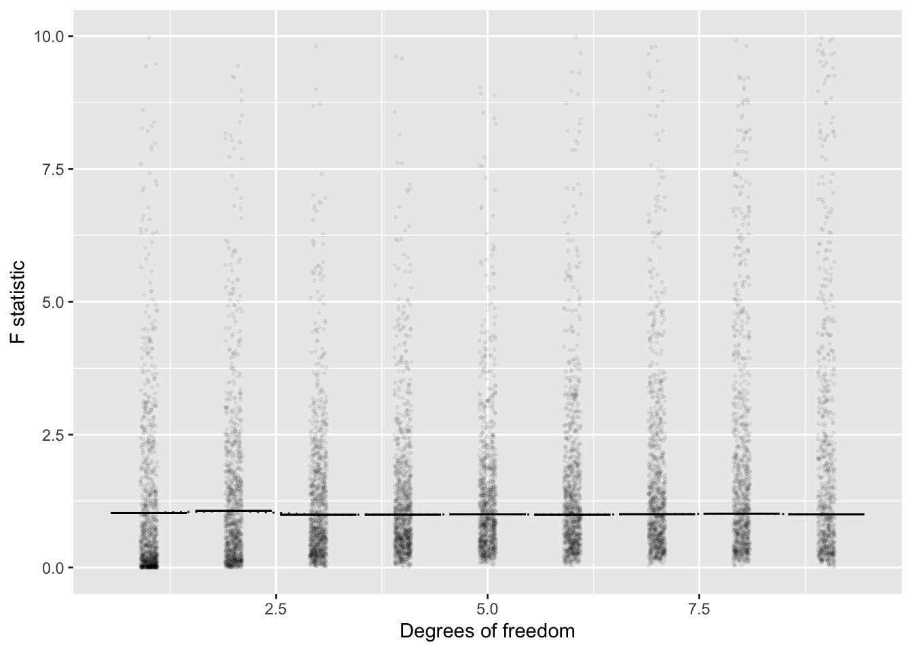
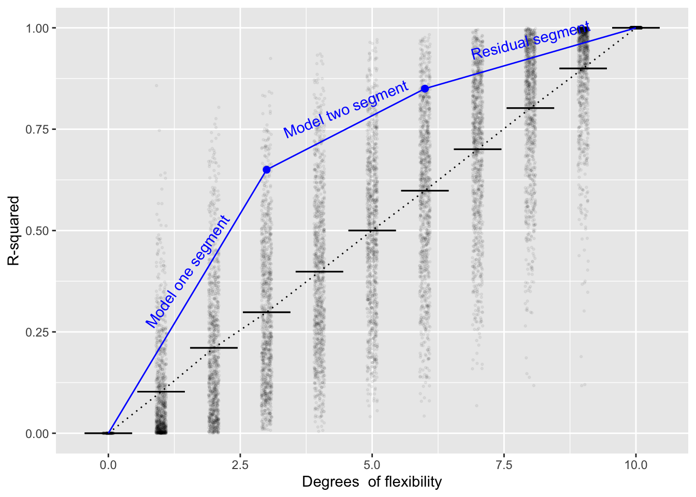

# Comparing models


Up to now, we have looked at models individually. It's time now to examine models in *pairs*. Such a perspective gives insight into *constructing* models, for example by including a new explanatory variable in addition to the old ones, or increasing the curvature used in a model function.

The basic strategy is simple. Start with an existing model, which we might call $\hbox{mod}_1$. Then extend or elaborate $\hbox{mod}_1$ in some way,  perhaps by including a new explanatory variable to produce $\hbox{mod}_2$.  We can then examine the *increase* in the variance of the model values from what it was under $\hbox{mod}_1$  to what it will be under $\hbox{mod}_2$. 

Since we are working with two models, it's helpful to modify the notation a bit. Before, we had $\hbox{v}_r$ and $\hbox{v}_m$, the variance of the response variable and of the model values respectively. We also had R^2^,  which is simply $\hbox{v}_m$ divided by $\hbox{v}_r$. We'll keep $\hbox{v}_r$ as standing for the variance of the response variable but write $\hbox{v}_1$ and $\hbox{v}_2$  as the  variance of the model values from $\hbox{mod}_1$ and $\hbox{mod}_2$ respectively. 

Likewise, it's useful to construct the R-squared ratios  for the  two models, which we'll denote $\hbox{R}^2_1$ and $\hbox{R}^2_2$, and which are simply $\hbox{v}_1 / \hbox{v}_r$  and $\hbox{v}_2 / \hbox{v}_r$ respectively.

## Complexity and cost

A central question when considering an extending $\hbox{mod}_1$ into  $\hbox{mod}_2$ is whether the resulting increase in variances, $\Delta \mbox{v} = \hbox{v}_2 - \hbox{v}_1$ is large enough to justify concluding that extending $\hbox{mod}_1$ to $\hbox{mod}_2$ is worth the cost.

The "cost?" What cost? Computing the new  model $\hbox{mod}_2$ and its model values is, with a computer, trivial and costs nothing. Rather, the cost of concern is the added *complexity* of $\hbox{mod}_2$ compared to $\hbox{mod}_1$. 

There is a tradition in science of assuming that, all other things being equal, simpler models are better than more complicated models. Sometimes this tradition is expressed as the "law of parsimony," as if it were a physical principle (which it is not, until you get very  deep into things as in quantum electrodynamics). Sometimes it is given the name "Occams's  Razor" in honor of William of Ockham (c. 1287–1347). Occam's Latin statement is 
 
> "*Numquam ponenda est pluralitas sine necessitate.*"

The English translation is scarcely better: "Plurality must never be posited without necessity." A somewhat earlier formulation might be clearer:

> *"It is superfluous to suppose that what can be accounted for by a few principles has been produced by many."* -- Thomas Aquinas (1225–1274)

It's deeply ironic that opinions from the 13th century be quoted as  support for scientific principles. At the start of the 20th century, however, some relevant mathematics started to emerge, the mathematics of random walks. This new mathematics provided insight into how complexity of a model might be measured and a criterion for judging whether adding complexity is worthwhile.

We'll put the  mathematical theory in a framework that we've already developed in earlier chapters. The ingredients are

- n, the number of rows in the data used to construct the model
- $^\circ\!{\cal{F}}_1$ and $^\circ\!{\cal{F}}_0$  the degrees of flexibility of $\hbox{mod}_2$ and $\hbox{mod}_1$ respectively.
- $\hbox{R}^2_2$ and $\hbox{R}^2_1$

Here are some relevant facts resulting from the mathematical  theory of random walks.

- Fact 1: If $\hbox{mod}_2$ is an *extension* of $\hbox{mod}_1$ (for instance, one created by including an additional explanatory variable) then $\hbox{v}_2 \geq \hbox{v}_1$.

    Justification: Reach back to Chapter 5 where we considered the process of creating a model function. Recall that the "best" model function is one that comes as close to the response variable as possible, given the selected set of explanatory variables. In extending $\hbox{mod}_1$, we are giving the process an additional variable to work with. Likely, there will be some way to use that additional variable  so that $\hbox{mod}_2$ gets even closer to the response variable than $\hbox{mod}_1$. But simply by *ignoring* the additional variable, $\hbox{mod}_2$ can at least as close as $\hbox{mod}_2$. 


- Fact 2: Suppose that all of the explanatory variables are unrelated to  the response  variable, for instance, they have been created at random. Then a model constructed with n-1  degrees of flexibility will have $\hbox{v}_m = \hbox{v}_r$.  What's  more, a model with $p < n-1$ degrees of freedom will,  on  average, have $\hbox{v}_m \approx \frac{p}{n-1} \hbox{v}_r$. Another way of stating this is that 
$$R^2 = \frac{\hbox{v}_m}{\hbox{v}_r} \approx \frac{p}{n-1}$$

    In  support  of Fact 2, we'll do some simulations. In each trial, we'll generate a small data set with $n=11$. The response variable will come from  a random number generator. Similarly we'll make up p=5 explanatory variables,  each of which is also from a  random number generator. Then we'll calculate R^2^ from each model and  look at the distribution. According to the principle, on average 
    
    $R^2 = \frac{p}{n-1} = \frac{5}{10}$. 

We'll do the simulation using R software and the `mosaic` package. I  provide  the code so that anyone who  wants to  carry out their own  simulation can do so.  We'll do 1000 trials.  


```r
library(mosaic)

Trials <-  do(1000) * (
  data.frame(y  = rnorm(n = 11)) %>%
    lm(y ~ rand(5), data = .) %>%
    rsquared()
)
mean( ~ result,  data = Trials)
```

```
## [1] 0.498377
```

You can repeat the simulation with any n and p that you like to confirm that, on average, $R^2 \approx \frac{p}{n-1}$.


```
## Warning: `data_frame()` is deprecated, use `tibble()`.
## This warning is displayed once per session.
```

## Why F?

We can use Fact 2 to explain why it makes sense for the  F-statistic to be defined the way it  is.  Consider  a graph  of the average R^2^ versus $^\circ\!{\cal{F}}$ when all the explanatory variables are made with a random number generator

(ref:randomR-cap) Figure 12.1: R^2^ versus $^\circ\!{\cal{F}}$ when all the explanatory variables are generated randomly. The horizontal lines show the *average* value of R^2^ across many trials, the small black dots show individual trials with $^\circ\!{\cal{F}}} = 5$. The blue dot stands for the R^2^ found from a model that is the subject of investigation, that is, a model for which we seek to check whether the explanatory variables are plausibly related to the response.

<div class="figure">

<p class="caption">(\#fig:randomR)(ref:RandomR-cap)</p>
</div>

In Figure  12.1, the blue point  falls  at R^2^=0.65 and $^\circ\!{\cal{F}} = 3$. Referring to  the individual random trials with $^\circ\!{\cal{F}} = 3$ (the black dots), you can see that a very small  percentage  have R^2^ > 0.65. This alone would cause one to doubt that  the  explanatory variables used in making the blue dot were purely random. In fact, a p-value  for the blue dot could be calculated simply by counting the proportion of black dots that have R-squared larger than the blue dot  (for $^\circ\!{\cal{F}} = 3$).

This book is about *classical inference*, so the use of simulation, a computer-era technique, is out of place. Classical inference resorts to a different observation. In Figure 12.1, there  are two blue segments. One connects the origin to the blue dot, the  other connects the blue dot to  the upper-right corner of the plot. We'll call  the left-most  segment the "model segment," since it reflects Clearly the slope of segment one is larger than the slope of segment two. This  will  happen whenever the blue dot is  above the vertical range of the random trials. But for the random trials, on average, the two slopes would be about the same. So, under the Null Hypothesis that the explanatory variables are  unrelated to the  response variable, the  ratio of slopes will be about 1.

Fisher suggested using the ratio of slopes in the  R^2^ versus $^\circ\!{\cal{F}} = 3$ graph as a test statistic. Given a blue dot with its R^2^  and $^\circ\!{\cal{F}} = 3$,  the  slope of segment one is $\mbox{R}^2_1 / ^\circ\!{\cal{F}}$.  Similarly, the slope of segment two is 
$(1 - \mbox{R}^2_2) / (n -  (^\circ\!{\cal{F}} +1))$. The ratio of slope one to slope two is F.

(ref:F-vs-df-cap) Figure 12.2. Translating the $R^2$ and $^\circ\!{\cal{F}}$ values from Figure 12.1 into the corresponding F value shows a much simpler version. On average, the F values from the random simulation are about $F=1$  regardless of $^\circ\!{\cal{F}}$. Similarly,  almost all the random  trials produce $F  <  4$. Fisher deduced these facts using  algebra and calculus with the mathematics of random walks, a remarkable achievement. Today, it takes only a moderate amount of computer-programming skill to confirm them.

<div class="figure">

<p class="caption">(\#fig:F-vs-df)(ref:F-vs-df-cap)</p>
</div>

## Analysis of variance

The word "analysis" refers to the process of breaking something down into its constituent components. (The antonym is "synthesis," the process of bringinging components together to form a whole.) 

The phrase "analysis of variance" concisely  describes the strategy for examining a model that consists of components. For example, we've described $\hbox{mod}_2$ as being an extension of $\hbox{mod}_1$ -- mod_2 consists of $\hbox{mod}_1$ plus some additional component.

In undertaking  analysis of variance, the quantity that is being broken  down is the  variance \hbox{v}_r_ of the response variable.  When working with a single model, the variance is broken down into  two components: 

- \hbox{v}_m_, the variance accounted  for by the model
- what's left over,  the residual variance, which is simply \hbox{v}_r_ - \hbox{v}_m_.

In the  previous section, I've chosen to report not  the variance itself, but the *proportion* of the variance of the response variable:

- $R^2 = \hbox{v}_m / \hbox{v}_r$, the proportion accounted for  by the model
- $1 - R^2 = (\hbox{v}_r - \hbox{v}_m) / \hbox{v}_r$, the residual proportion of the variance. 

The idea of analysis of variance can be extended to the  situation of a model $\hbox{mod}_2$ which has been built as an extension to a model $\hbox{mod}_1$. The situation is sketched in Figure 12.3. First, calculate $\hbox{R}^2_1$, the  proportion of  the variance accounted for by $\hbox{mod}_1$. Second, calculate $\hbox{R}^2_2$, the proportion  of the variance captured by  $\hbox{mod}_2$. In  Figure 12.3, $\hbox{R}^2_1$ is the left-most blue dot, while $\hbox{R}^2_2$ is  the other blue dot.

The two blue dots divide the domain of the graph into three components: the model-one segment, the model-two segment, and the residual segment. 

To address the question of whether $\hbox{mod}_2$ meaningfully extends $\hbox{mod}_1$, we compare the slope of the model-two segment to  that of the residual segment. This ratio of slopes, which we can call $\Delta \hbox{F}$, is the test statistic. If $Delta\hbox{F} \gtrapprox 4$, it's fair to  conclude that the extension  to $\hbox{mod}_1$ is discernably different from  an extension that would have been concocted from random explanatory variables unrelated to the response variable.

(ref:two-models-cap) Figure 12.3: looking at how the extensions to $\hbox{mod}_1$ contained in $\hbox{mod}_2$ increase $\mbox{R}^2_2$ compared to $\mbox{R}^2_1$

<div class="figure">

<p class="caption">(\#fig:two-models)(ref:two-models-cap)</p>
</div>

As a formula, the ratio of the slopes of the model-two segment to the model-one segment is:

$$\Delta \mbox{F} = \frac{n - (^\circ\!{\cal F}_{2} + 1)}{^\circ\!{\cal F}_{2} - ^\circ\!\!{\cal F}_{1}}  \cdot \frac{\hbox{R}^2_{2} - \hbox{R}^2_{1}}{1 - \hbox{R}^2_{2}}$$

## Analysis of co-variance

It sometimes happens that $\hbox{mod}_1$ contains all the explanatory variables of direct interest and the point of building $\hbox{mod}_2$ is to include those covariates which ought to be taken into consideration but are not of direct interest. In this situation, the ratio of interest is the slope of the model-one segment to the slope of the residual segment. This is called "analysis of co-variance."

I like to describe the purpose of including the covariates in $\hbox{mod}2$ as "*eating variance*." That is, the covariates can reduce the slope of the residual segment, making it easier for the model-one segment to look steep by comparison.

