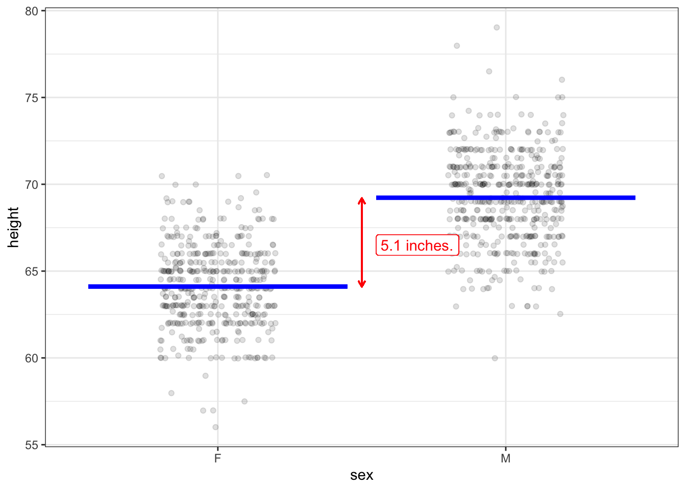

# Effect size

An *effect size* tells how the output of a model changes  when a simple change is made to the input. Many statistical claims are made in terms of an effect size. For instance, according to the [US National Highway Traffic Safety Administration (NHTSA)](https://www.nhtsa.gov/risky-driving/seat-belts), wearing seat belts reduces the risk of fatal injury to passenger-vehicle occupants by about 58%. [@kahane-2017] This is an effect size.

In contrast, this related fact from NHTSA is *not* an effect size: 51% of male passenger-vehicle occupants killed in 2017 were not wearing seat belts.

An effect size summarizes a comparison between two different conditions. In  the first example, those two conditions are 1) wearing a seat belt and 2) not wearing a seat belt. In the second example, however, there is just one condition: being a male passenger-vehicle occupant who died in a car accident in 2017.

## With respect to ...

Effect sizes always involve two variables: a response variable and a single explanatory variable. Effect size is always about a *model*. The model might have one explanatory variable or many explanatory variables. Each explanatory variable will have its own effect size, so a model with multiple explanatory variables will have multiple effect sizes. 

We use the phrase "with respect to" indicate which explanatory variable is involved in an effect size. For instance, in the previous example, the response variable is "risk of fatal injury" and the explanatory variable records whether the vehicle occupant was wearing a seat belt. So we would call the quoted 58% the "effect size on risk of fatal injury *with respect to* wearing seat belts."

Depending on the purpose of your work, you may want or need to include other explanatory variables in your model. For instance, the NHTSA gives a "safety star rating" to each year-make-model of vehicle. If this were included in the risk-of-fatal-injury statistical model, there will be an effect size of "risk of fatal injury *with respect to* safety-star rating." Other explanatory variables might be speed of the vehicle at the time of the accident (though this can be difficult to measure), weight of the vehicle, the index of traction/slipperiness of the road surface, and so on.

Depending on the variable selected to play the role of "with respect to," an effect size can serve very different purposes. For instance, the quoted 50% reduction in risk of fatal accident with respect to wearing a seat belt, provides a good argument for wearing seat belts. The effect size of risk of fatal accident *with respect to* safety-star index could help people shopping for a car. It would also give an concrete sense of whether the difference between  a four- and a five-star vehicle is substantial or trivial.

## Slopes  and differences

Consider two models introduced in Chapter 5. Figure 5.1 shows child's height versus mother's height in Galton's data. The straight-line model shows a slight upward slope. To calculate the effect size of child's height *with respect to mother's height*, pick two  values of mother's height: say 60 and 68 inches. From the graph  you can read the output of the model at these two values of the input. At an input of 60 inches, the output is 65.5 inches. At an input of 68 inches, the output is (coincidentally) 68 inches. The effect size is the slope of the model: rise over run. Here, the "run" is 68 - 60  = 8  inches. The "rise"  is 68  - 65.5 = 2.5  inches. So the slope is 2.5 / 8 = 0.31.

The model in  Figure 5.1 has a quantitative explanatory variable: mother's height. In  constrast,  the model in Figure 5.2 has a categorical explanatory variable: pollen shape. To calculate an effect size *with respect to pollen shape* in Figure 5.2, follow much the same procedure. First, pick the two input levels you want to compare. Here, there are only two levels possible: long and round shapes. Next, look up the model output at each of the two inputs. The output of the model is  framed as a probability. The probability of a white flower is 24% for long pollen, and 25% for round pollen. 

Since the explanatory variable is a categorical variable, it doesn't mean much to look at the numerical difference in the input. The model output, on the other  hand, is quantitative (as it is for all the  models we consider in this book). The effect size is 25% - 24%  = 1 percentage point.

To recap, when the explanatory variable is *quantitative*, the effect size  is stated as a *slope*: change in output divided by change in input. When the  explanatory  variable is *categorical*, the effect size can be stated as a *difference*. In this situation, it's important to say which way the effect goes. For instance, the NHTSA risk of fatal injury with  respect to wearing a seat belt was described as a *reduction* in risk when wearing a seat belt compared to not wearing one.

## Risk

In the previous paragraph, I say "*can* be stated  as a difference" because there are other ways often used to  compare the model output between two different levels of a categorical explanatory variable. For instance, when the output is interpreted as a "risk," the two outputs might be compared as a *ratio*, called  the *risk ratio*. It sounds odd when talking about flower color, but if we were thinking about the "risk" that a pea plant's flowers are white, then it would be appropriate to consider the effect size with respect to  pollen shape as the ratio  25% / 24% = 1.04. Note that this 1.04 is not in percent. When writing about risk ratios, people often use percentage terms.  The risk ratio of 1.04 might be described,  "The risk of a white flower increases by 4 percent." Were the risk ratio smaller than 1, say 0.87, we would speak of a risk *decrease*: "The risk of a white flower is 13% lower for ...."

It's potentially confusing for us to report *differences* of risk in  "percentage points" and *ratios* of risk as "percent." Not everyone is sensitive to  the distinction between "percentage  points" and "percent." Perhaps it would be helpful to report differences as an *absolute* change in risk while ratios are a *relative* change in risk.

There's yet another way used to describe changes in risk: the *odds ratio*. Odds are a different format for describing risk. If the probability of an outcome is $p$, the odds are $p/(1-p)$. So, the odds of a white flower in a plant which has round pollen is $0.25/(1-0.25) = 0.25 / 0.75 =  1/3$. The use of odds, and its cousin, *log odds*, is a genuine help when working with models with multiple explanatory variables.

## Simple changes in input

I'm using the word "simple" to refer to the change in input involved in an effect size. Several considerations motivate this:

- When looking at a categorical explanatory variable, an effect size is a comparison of just two of the levels. 
- When looking at a quantitative explanatory variable, I advocate using a *finite* change in input,  e.g. the 60 inches to 68 inches in mother's height. That's simpler than the alternative, using an *infinitesimal* change in  input, and more appropriate for many machine-learning models where the output can vary discontinuously as the input changes. 

But the main thing I want to emphasize with the word "simple" has to do with models with multiple explanatory variables. In such models, there are different effect sizes for the different explanatory variables. That is, an effect size reports the change in model output when a *single* one of the explanatory variables is changed, holding all the others constant. This is where the phrase "with respect to" comes into play. For instance, the model displayed in Figure 6.4, with child's height as the response variable, involves three explanatory variables: mother's height,  father's height, and child's sex. An effect size in such a model refers to a specific explanatory variable. So it's meaningful to speak of the effect (on child's height) with  respect to mother's height, or the effect with respect to  father's height, or the effect with respect to child's sex. Which one is right for you depends on what you are investigating.

## Reading effect size from a graph

Chapter 6 introduced four simple settings for statistical inference that are at the core of conventional statistics books. In every setting, the response variable is quantitative. The single explanatory variable is either categorical (as in Figure 6.1(a) or quantitative (as in Figure 6.1(b)).

For convenience, I'll repeat  those two figures here, with some annotation to show how to calculate the effect size.

Figure 7.1: A reproduction of Figure 6.1(a) with annotations to show the effect size.

The model in Figure 6.1 is height as a function of sex. The model values are marked as blue lines: 64.1 inches  for "F" and  69.2  inches for "M". Changing the input  from F to M therefore brings about a change of $69.2  - 64.1 = 5.1$ inches. Since the explanatory variable is categorical, the effect size with respect to sex ("F" $\rightarrow$ "M") is 5.1 inches. 

Less stilted language would be, "Men tend to be 5.1 inches taller than women." But watch out. The "men tend to be ..." statement is easily interpreted as being about men and women. In fact, as you can see from the dots in the graph, many women are taller than many men. Keep in mind that the 5.1 inches is an effect size.

When the explanatory variable is quantitative, the effect size is presented as a slope. To calculate the slope, select two different values of the explanatory variable, as with the ones marked with vertical lines in Figure 7.2 below. 

Figure 7.2: A reproduction of Figure 6.1(b) with annotations to show the effect size.

The two values selected for the explanatory variable (mother's height) are 60 and 68 inches, so the run is 8 inches. For an input of 60 inches the model  output is  65.5 inches. For an input of 68 inches, the model output is 68.0 inches. thus, the run is 2.5 inches. The effect size is the ratio of rise to run: 2.5 inches / 8 inches = 0.31.

