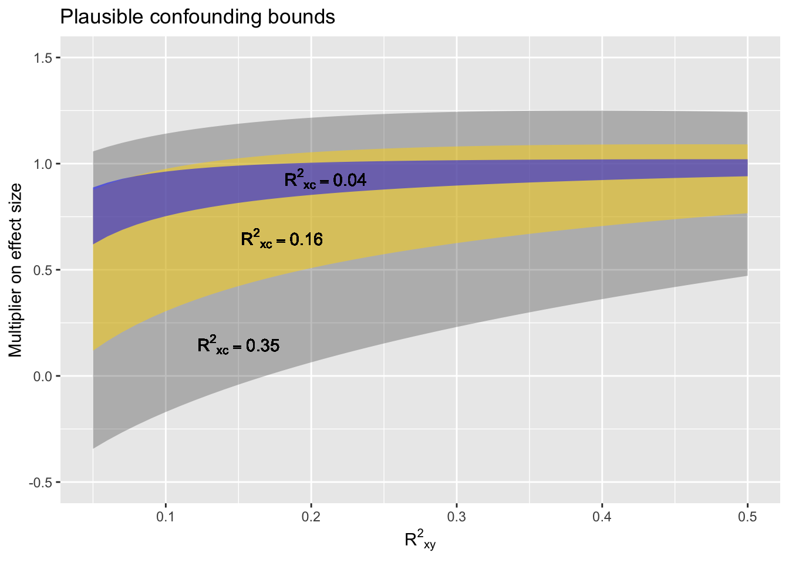

# Remember, inference isn't everything

Study design, sampling bias, etc.

## Confounding

Traditionally, introductory statistics courses emphasize the idea that "correlation is not causation." This is only  true  in  the sense that knowing that there is a correlation  between X and Y does not tell you which way the direct causal link between X and Y, if any, goes.

I prefer to say that "correlation *is* causation." 

a. X $\rightarrow$ Y
b. X $\lefttarrow$ Y
c. X $\leftarrow$ C $\rightarrow$ Y
d. X $\rightarrow$ C $\leftarrow$ Y

There are other possibilities that are variations on (c) and (d) with a causal connection between X and Y, for instance

      or   

## Techniques when "degrees of freedom" are unknown,  as  with machine  learning methods.
